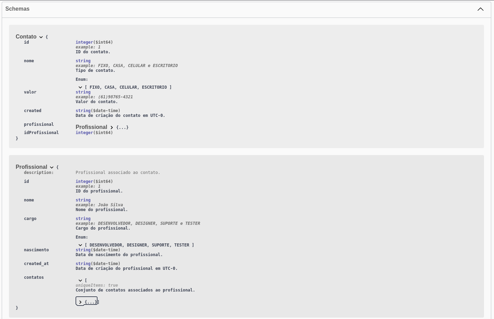
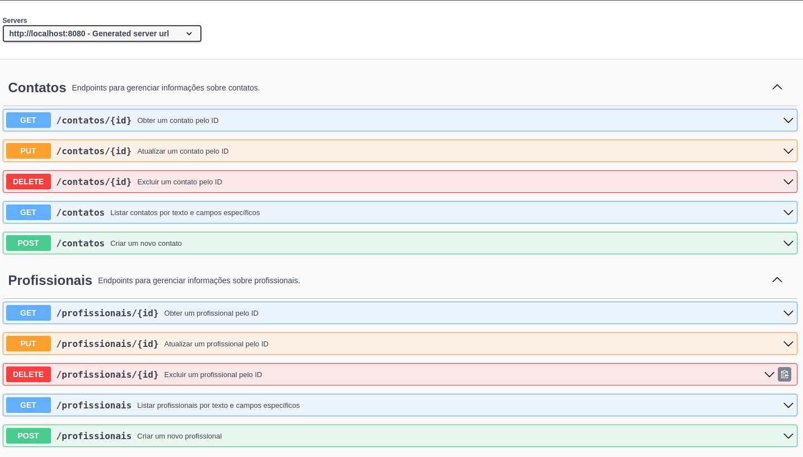

<p align="center">
  
</p>

## Description

The PRM (Professional Resource Management) application is a Rest API for registering and controlling professionals and their specialties, maintaining two entities: the Contact and the Professional related to this contact.

This application was built to satisfy a technical assessment in a selection process for the company Simples Dental. A selection process in which I was unsuccessful in the last stage, but nevertheless passed several others, including the technical test phase in which this application was the product.

## How to Set Up The Application to Running

**1. Check your Java version**
The Gradlew manager in this project is using version 17

**2. Project dependencies**
```bash
dependencies {
	implementation 'org.springframework.boot:spring-boot-starter-data-jpa'
	implementation 'org.springframework.boot:spring-boot-starter-jersey'
	implementation 'org.springframework.boot:spring-boot-starter-web'
	implementation 'javax.servlet:javax.servlet-api:4.0.1'
	implementation 'org.springdoc:springdoc-openapi-starter-webmvc-ui:2.2.0'
    implementation 'org.jetbrains:annotations:24.0.0'

    testImplementation 'org.springframework.boot:spring-boot-starter-test'
	testImplementation 'com.h2database:h2:1.4.200'

	compileOnly 'org.projectlombok:lombok'
	annotationProcessor 'org.projectlombok:lombok'

	runtimeOnly 'org.postgresql:postgresql'
}
```

**3. Start a postgres instance**
```bash
$ docker run --name some-postgres -p 5432:5432 -e POSTGRES_PASSWORD=123456 -d postgres
```

**4. Swagger API Visualization** 
Once you have completed all the above steps and are running your Java Spring application, go to the following link: [PRM Rest API](http://localhost:8080/swagger-ui/index.html#/) 
```bash
Raw link: http://localhost:8080/swagger-ui/index.html#/
```

## Schemas and Swagger API Resources



